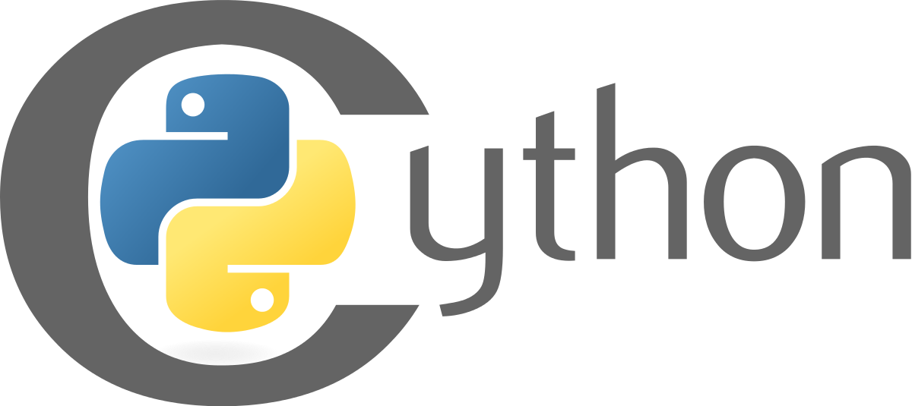
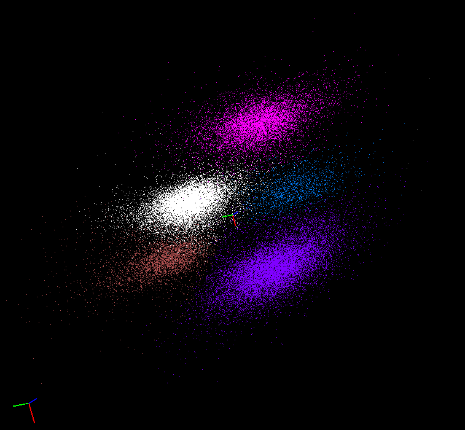
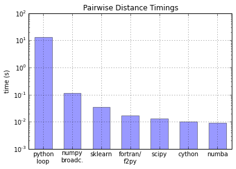

# Accelerate your code with Cython and Numba

<p align="center">
   
   </a>
</p>

<p align="center">
   
   </a>
</p>

- Outline
    - Python C extensions
        - ctypes
    - Cython
    - Numba

## what happens when you type `python`?

- runs a program called "python"
- Python is actually a C program
    - source code for Python itself is written in C, called CPython
    - alternate implementations in other langauges
        - Java: Jython
        - C#: IronPython
        - Python: PyPy

## why write C extensions?

1. create Python interface to a C library
    - example: data acquisition system that only comes with a C interface
    - write C extension which allows Python access to that C library, and therfore the acquisition hardware
    - writing C extensions by hand is **tedious** and **difficult**
    - `DT.c` example
    - accessing C libraries is now **much** easier using builtin module `ctypes`
        - lets you directly call any C library function from within Python

2. accelerate your code!
    - what's wrong with this code?
    ```python
    a = 0
    for i in range(1000000000):
        a += 1
    ````
    - code written in C won't have overhead of Python, can *potentially* run much faster

## when *not* to accelerate your code:

- when it doesn't matter - don't waste time optimizing code that doesn't take much time anyway

> "Premature optimization is the root of all evil" — Donald Knuth

<p align="center">
   
   </a>
</p>

- Pareto principle, i.e. 80/20 rule, i.e. power law distribution
    - probably some small part of your code takes up most of the execution time
- find the part of your code that's the slowest, work on that
    - profile your code to find the slowest parts:
    - `import profile`, `import cProfile`, or in IPython use `prun`

## first and best option: numpy!

- built-in functions like `np.mean()` are written in highly-tuned C code
- vectorize! (see upcoming Super Python talk)
- but some complex loops you simply can't vectorize with numpy
- sometimes you need complicated loop(s) that iterates over every entry in an array
- example: gradient ascent clustering algorithm, thousands or millions of points in ND space
  1. calculate local ND density gradient for every point
  2. move each point slightly up its density gradient
  3. for each point, check if any other points in ND space are close, if so merge them
  4. repeat 1-3 until all remaining points stop moving

<p align="center">
   
   </a>
</p>

## Cython: http://cython.org

- a much easier way to write C extensions
- Cython language is superset of Python
    - Python code + static C type declarations
    - evolved from its predecessor called "Pyrex"
1. write your extension in Cython syntax in `.pyx` file
2. "cython" it to generate C code
    - `cython` is a command line program that converts `.pyx` to `.c`
3. compile the C code with a compiler
4. import the compiled C extension from within Python
    - `import myextension`
- `pyximport` compresses these steps into just two: write `.pyx` file, import it in Python
- in IPython, can use `%%cython` to denote a block of Cython
- see `cython_example.py`
- modify Cython example to do RMS instead of mean

## the GIL

- Global Interpreter Lock
- allows Python to track references to objects, and therefore do garbage collection and automatic memory deallocation when an object is no longer needed
- makes Python safer, reduces/eliminates memory leaks
- but, the GIL is incompatible with multithreading
    - multithreading: single process, multiple threads w/ shared memory
    - multiprocessing: separate processes w/ separate memory
    - allows taking advantage of multiple CPU cores
    - multithreading can speed up your code without using lots of memory
- turning off the GIL allows you to use multithreading, exposes you to the risks
    - however, if your threads are simple, i.e. your code is "embarassingly parallel", then it's relatively safe, with big payoff
- put section of Cython code in a `with nogil` block to release the GIL for that code
- or, use `prange()` instead of `range()`
- multithreading in Cython requires OpenMP

## Numba: http://numba.pydata.org

- newer than Cython, maybe less stable/mature
- Numba is harder to install, so harder to distribute code that relies on Numba
- but, Numba is **much** simpler than Cython. It's close to magic!
- should work out of the box in Anaconda distribution on any platform
- installing separately is a bit tricky:
    - need to install the LLVM compiler "system"
        - LLVM = low-level virtual machine originally
        - like an alternative to GCC, allows for "just in time compiling" similar to Java, but for any language, including C and Python

## JIT

- JIT = "Just in time"
    > Compilation of a function at execution time, as opposed to ahead-of-time compilation.
- "decorate" your Python function with `@jit`, or pass it through `jit()`, and you'll get a faster version
    - what's a decorator?
    - dynamically modifies a function/method
        - little bit analogous to subclassing a class and redefining some methods
        - wraps a function in other code
        - on every call, a decorator gets the original function and its arguments, and can then do whatever it wants with them
        - to stop decorating, remove the @decorator, or the decorator() call
```python
from numba import jit
numba_function = jit(python_function)
```
- http://numba.pydata.org/numba-doc/dev/user/examples.html
- see `numba_example.py`
- modify Numba example to do RMS instead of mean

## More speed comparisons

- "Numba vs. Cython: Take 2"
    - https://jakevdp.github.io/blog/2013/06/15/numba-vs-cython-take-2/
    - comparison of plain python, numpy, cython, Numba, and other acceleration methods,
    - uses example of calculating a 2D numpy array of pairwise distances
    - demos returning a 2D array instead of just a single value

<p align="center">
   
   </a>
</p>

- newer: "Numba vs Cython: How to Choose"
    - https://eng.climate.com/2015/04/09/numba-vs-cython-how-to-choose/
- older: "A beginner's guide to using Python for performance computing"
    - http://scipy.github.io/old-wiki/pages/PerformancePython

## Conclusion

- long loops written in pure Python are inefficient
- optimize the slowest parts of your code first
- various acceleration methods avoid Python loops and do as much as possible directly in C
    - numpy - good for code that can be easily vectorized
    - Cython - fast, flexible, complicated
    - Numba - fast and simple!

<p align="center">
   
   </a>
</p>

<p align="center">
   
   </a>
</p>
